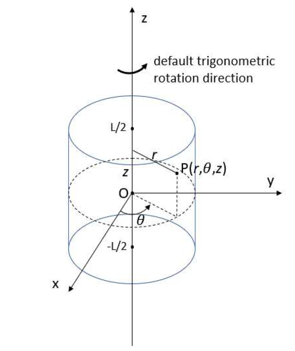
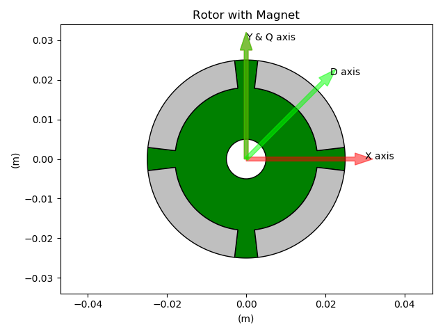
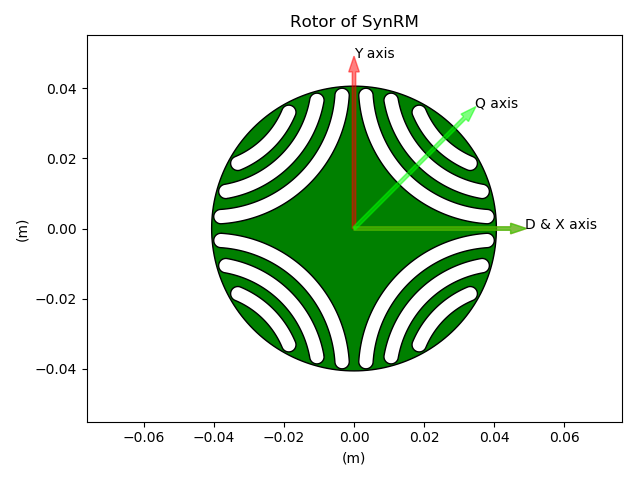
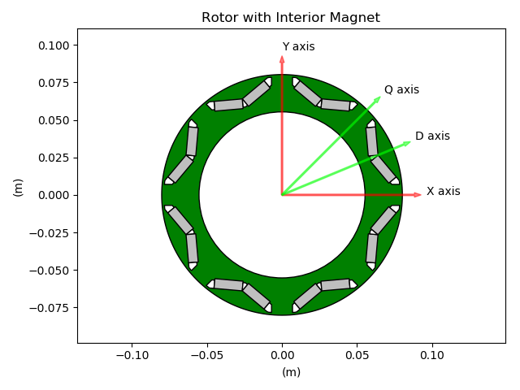
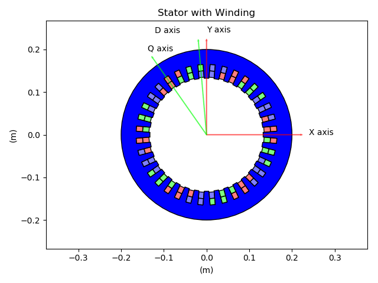
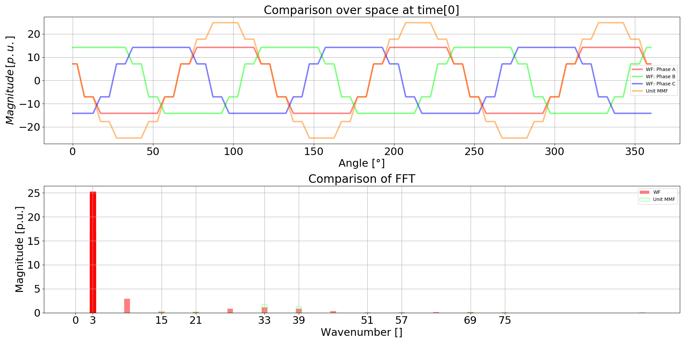
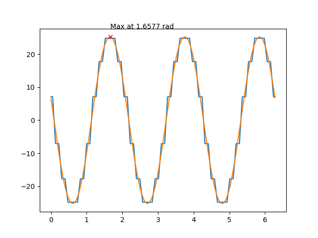
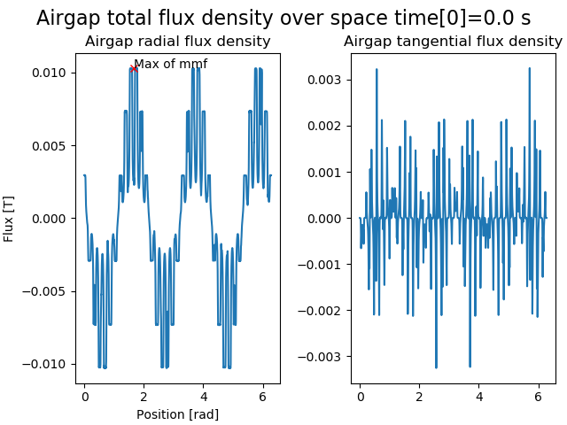
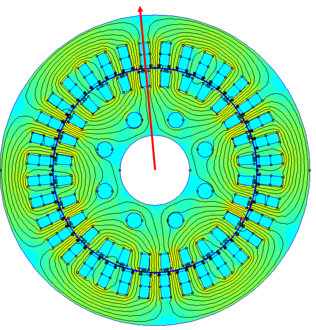

################
Axis Conventions
################
Default reference frame is the cylindrical frame (r,theta,z).
The machine center is assumed to be at (0, 0, 0) and the 0z axis is the rotation axis of the machine (for both radial and axial flux machines). That way if the machine total length is L, it extends from Zmin= –L/2 to Zmax=+L/2.

Lamination axes
===============
In Pyleecan, we define each axis depending of its angle with the X axis. For instance the method comp_angle_d_axis will return the angle of the D axis of a Lamination according to the X axis.
By convention, the initial position of a Lamination is defined to have the X axis at the middle of a tooth (inter-pole). The convention is used to provide a convenient default position to "cut" the lamination for FEA computation with symmetries.

For D/Q axis the following conventions are used for each lamination kind:

LamSlotMag
----------

LamHole without magnets
-----------------------

LamHole with magnets
--------------------

LamSlotWind
-----------

The LamSlotWind D axis is defined to be the first angle where the fundamental of the unit mmf (and of the flux) is maximum at t=0. This definition also match the alpha axis. This definition was set to enable to define the Machine method comp_angle_offset_initial (initial position of the rotor for electromagnetic computation) as the different between the D axis of both lamination whatever their type. 

The code to reproduce all of these figures is available in Tests/Plot/test_axis.py