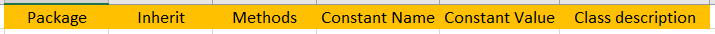

#################
Class generation
#################

.. role:: green

Why do we generate our classes
------------------------------

The class files are very complex but very similar. The only things that defer from one class to another are the
properties and methods. So every class file is a copy/paste/adapt of a template. To avoid doing this by hand
(which would be time consuming and source of errors), we have created a “code generator” that reads our documentation and
automatically writes the class files according to our template. That way, to add a new properties to a class, change a
maximum, rename a method… the only thing needed is to update the documentation and run the generation process.

How is the documentation organized
----------------------------------
As there are many classes in PYLEECAN, we have created some groups to sort them. For instance the group “Slot” contains
every single slot related class. We have created a reference CSV file for each class. They all follow the same logic and
contain all the information about the corresponding classes. The name of the CSV file is the name of the corresponding class
and must be unique within Pyleecan.

Each CSV file contains one sheet with two tables:

.. image:: _static/table1.png

The first table is for the properties of the class. Each line of this table is a property and its related information. Note
that the order of the column is the same in all the documentation to allow the generation. If you need to add a new column
or change the order, you will need to adapt the value inside Generator.read_fct.py to make sure that the generator will still work.

Here are the meaning and the use of the column:

-	:green:`Variable name`: The name of the property to create in the object. It must be in English and follow the :ref:`coding.convention:pyleecan naming rules`
-	:green:`Unit`: This field is for documentation only and is not used in the generation
-	:green:`Description (EN)`: We use this definition to create the help text of every property of our object. Please make sure that there always is a definition (even if the property name is clear). For description on several lines, use \n in the description text.
-	:green:`Size`: 0 for scalar, 1 for vector, 2 for Matrix… (documentation only)
-	:green:`Type`: The type of the object. It will be used to check the input data (to prevent the user from providing a string when an integer is needed). You can specify a PYLEECAN class name (even from other group), it will allow the use of this class and any of its inherited classes. For matrix and vector, use “ndarray”. You can also provide: “[Slot]” which allow to specify a list of Slot object for instance. Finally you can set a type from a dependency with for instance "deap.base.Toolbox" to use the "Toolbox" type from deap.
-	:green:`Default Value`: You must provide a default value for the __init__ method.
-	:green:`Minimum value`: You may provide a minimum value (the test is <=)
-	:green:`Maximum value`: You may provide a minimum value (the test is >=)

The second table is for global class information and methods:

-	:green:`Package`: The name of the group (ie the name of the group which the class belongs e.g: Slot, Material)
-	:green:`Inherit`: Name of the mother class (even from another group)
-	:green:`Methods`: Name of the methods of the class (one line by method ideally in alphabetical order)
-	:green:`Constante Name / Value`: To add constant to the class (one line by constant)
-	:green:`Description classe`: Help text of the class

Class creation
--------------
To add a class, the only thing to do is to create a CSV file named with the class name and fill it with the two tables in
:ref:`class.generation:How is the documentation organized`. The CSV file created will be added in
**/Generator/ClassesRef/<Group>/<Class name>** with the right group name and finally call the class generator.

Everytime the csv doc is updated, the code generator needs to be called to update all the corresponding python code.
For that you need to run the script:
::

        python pyleecan/Generator/run_generate_classes.py

Generated code
--------------

You will find the generated classes in **pyleecan/Classes/**. The code generated in each class consists of:

- the automatic import of all the class methods from **pyleecan/Methods/<Group>/<Class Name>/**. The import takes into account that the import may fail because some methods use some non-mandatory dependencies. If the dependencies are missing, the error will occur only if you use the corresponding method.
- an init() method with the possiblitiy to define the class according to a dictionary named "init_dict".
- the  method to convert the class to string.
- the method to convert the class to a dictionary (in general used to generate the init_dict).
- the getter and setter of each property. The setter checks the type, min and/or max of the user input value before setting the property.
- the method to save the class to json.
- automatic docstring is also added following the CSV documentation so that the user can have inline help.

For futher information about the class generation process:

    .. toctree::
        :maxdepth: 2

        generation.process
