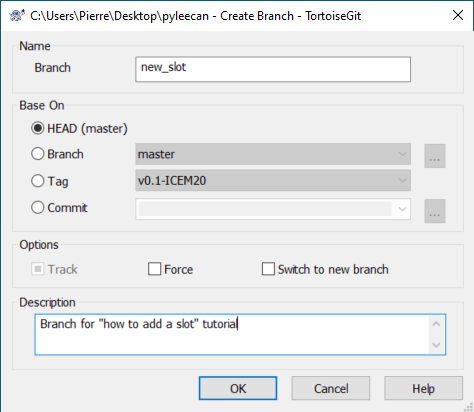

How to create a branch in PYLEECAN
==================================

The first step to work on a contribution is to create a "branch on git".
This tutorial will introduce some basic know-how on Git which is the
tool that will enable you to share your work with the community. There
are lots of tutorials and videos on the web to learn about Git, the more
you will learn the most efficient you will be if things get complicated.
You can start with [this tutorial from Github](https://try.github.io/).
This tutorial focusses only on the very basis that are needed to
contribute to Pyleecan "as quickly as possible". We recommend taking
some time to explore some more detailed tutorials to better understand
this powerful tool. In general, if you are not familiar with git, we
strongly recommend using it for any valuable piece of code that you
produce. It will significantly improve your work (and opening a
repository on Github is free if you want to share your work).

This tutorial will use TortoiseGit on Windows which is a user-friendly
way of using git:

-   [Download Git](https://git-scm.com/downloads)
-   [Download TortoiseGit](https://tortoisegit.org/download/)

What is Git?
------------

Git is a tool that will track every single modification of a project. It
will keep in memory the full history to easily know:

-   Who has done a modification, when and why?
-   What is the history of a single file?

As all the project is seen as an ordered list of modifications (a file
is edited, deleted, created…), Git can do the following:

-   Get modifications from other users and merge it with yours
-   Cancel some modifications to come back to an older version of the
    code.

What are branches?
------------------

To contribute to pyleecan, the first thing needed is **to create a
"branch"** on your forked version of pyleecan. In the following example
a branch named “new_slot” is created by right clicking on the pyleecan
folder then selecting “TortoiseGit” and “Create Branch”:

A branch is a parallel version of the code that will cleanly isolate
some modifications from the “official version”. It indicates from where
“your version” of the code started and what was done step by step (or
version by version) to get to your current state.

You then need to select your branch to start working on it. For that,
right click on the pyleecan folder then “TortoiseGit” and
“Switch/Checkout” and select the “new_slot” branch:

Now all further modifications will be added to the "new_slot" branch.
It is possible to come back to the "original" code by “Switch/Checkout”
to the branch "master".
