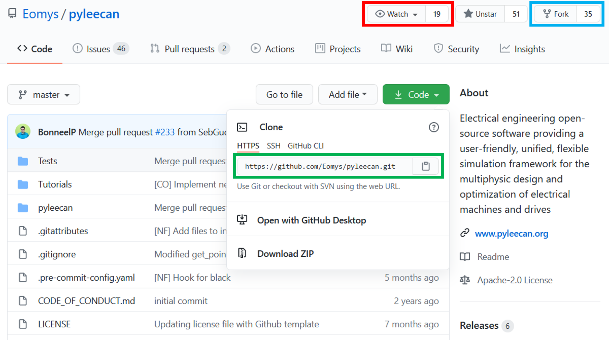

How to install PYLEECAN to contribute
=====================================

This tutorial will introduce some basic know-how on Git which is the
tool that will enable you to share your work with the community. There
are lots of tutorials and videos on the web to learn about Git, the more
you will learn the most efficient you will be if things get complicated.
You can start with [this tutorial from Github](https://try.github.io/).
This tutorial focusses only on the very basis that are needed to
contribute to Pyleecan "as quickly as possible". We recommend taking
some time to explore some more detailed tutorials to better understand
this powerful tool. In general, if you are not familiar with git, we
strongly recommend using it for any valuable piece of code that you
produce. It will significantly improve your work (and opening a
repository on Github is free if you want to share your work).

What is Git?
------------

Git is a tool that will track every single modification of a project. It
will keep in memory the full history to easily know:

-   Who has done a modification, when and why?
-   What is the history of a single file?

As all the project is seen as an ordered list of modifications (a file
is edited, deleted, created…), Git can do the following:

-   Get modifications from other users and merge it with yours
-   Cancel some modifications to come back to an older version of the
    code.

Step 1: Create a GitHub account
-------------------------------

GitHub is an online hosting platform for projects monitored with Git, and has been chosen to host PYLEECAN. 
It is therefore mandatory to use GitHub in order to contribute to PYLEECAN.

The first step is to create your own GitHub account [here](https://github.com/).

Step 2: Fork PYLEECAN
---------------------

You can then go the the [pyleecan repository on GitHub](https://github.com/Eomys/pyleecan):

and [fork](https://help.github.com/en/articles/fork-a-repo) the pyleecan 
repository in your own account, ie get a copy of the repository in your GitHub projects 
(click on the fork button in the blue square in the previous picture). 

The forked repository will allow you to freely experiment with changes
without affecting the original project. Later you will be able to send
modifications from your fork to the main project on Github with a
["pull-request"](https://docs.github.com/en/free-pro-team@latest/github/collaborating-with-issues-and-pull-requests/creating-a-pull-request) 
(see also this [tutorial](integrate.contribution.md)).

You can also click on "Watch" (red square on the
picture) to choose how you want to be notified of the activities of the
community.

Step 3: Download the source code
--------------------------------

The next step is to download the source code from your fork. 

For this method you will first need to install [git](https://git-scm.com/) 
or [github desktop](https://desktop.github.com/). For Windows users, 
you may also want to install [Tortoisegit](https://tortoisegit.org/download/) 
(or any equivalent) for a more convenient use of git. 

Once git is installed you can **"clone"** the repository (either though command 
line or the tool you have installed with git) with the following command 
(green square on the picture):

`git clone https://github.com/Eomys/pyleecan`

This method will enable you to get the upcoming modifications of the Pyleecan's code in a more convenient way.

Step 4: Install dependencies
----------------------------

Now that you downloaded PYLEECAN, you need to install the dependencies.
All of them are gathered in the file
[requirements.txt](https://github.com/Eomys/pyleecan/blob/master/requirements.txt).
You can install them with one single command with
[pip](https://pypi.org/project/pip/) (which should have been installed
with python): :

    pip install -r requirements.txt

If you want to contribute, we recommend to set a pre-commit hook to
automatically apply [black](https://pypi.org/project/black/) before
every commit (if you are using python \>=3.6). First install the package
pre-commit with the command: :

    pip install pre-commit

Then in the top folder of pyleecan run the command: :

    pre-commit install

The file "pyleecan/.pre-commit-config.yaml" is used for the
configuration. You can edit it to set a particular python version if
your default one is not \>=3.6 (for instance).

You are now ready to contribute to PYLEECAN.
