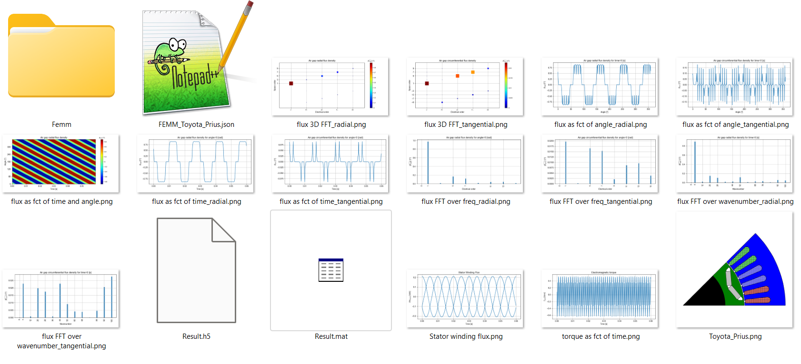
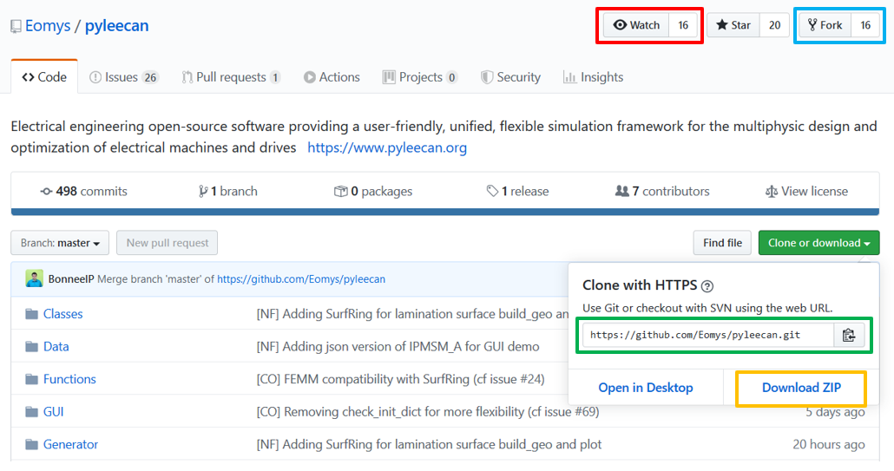

Install PYLEECAN
================

Welcome to the PYLEECAN installation page. There are three different methods to
install PYLEECAN depending on what you plan to do:
- 1) Get the GUI from the installer (fastest and simplest  but limited to FEMM)
- 2) Get the package from pypi (to use in python scripting/notebook)
- 3) Get the code from Github (to contributing to pyleecan)

Installing third party software (all three methods)
---------------------------------------------------

The principle of Pyleecan is to enable the user to choose between
several models to compute the same quantities. Some of them call other
software that you need to install as well (if you plan to use them). For
now, the following software have a coupling with pyleecan:

-   [FEMM](http://www.femm.info/wiki/Download) (Windows only for now, soon Linux should be available)
-   [GMSH](http://gmsh.info/)
-   [Elmer](http://www.elmerfem.org/blog/)

Method 1: GUI installer
-----------------------
This method is dedicated to the ones that want to use pyleecan to generate/run FEMM simulations without dealing with python and package management.

For the first method, you will find here the installer of the different pyleecan versions:
- v1.4.0 released 02/09/22

This installer is available only for Windows. It enables to define a machine and to run single speed magnetic current driven FEMM simulations (with symmetry, parallelization and sliding band). At the end of the simulations all the meaningful results are gathered in the result folder:

This installer is the fastest way to define and run this kind of simulation but several important features (like variable speed simulations, parameter sweep or optimization) are not available.

Getting python (Methods 2 & 3)
------------------------------
For method two and three, you will need to install Python and preferably an **IDE** (Integrated Development Environment).

To be able to use PYLEECAN you will need to download
[Python](https://www.python.org/downloads/). We recommend to use python version 3.8.X
Support with older Python version haven't been tested and should be possible. If you experience difficulties with running
Pyleecan with any version of Python, please [open an issue on
Github](https://github.com/Eomys/pyleecan/issues) to talk about it.

The next needed tool is an **IDE** (Integrated Development Environment) to write and execute python code/scripts.
There are too many IDE to count and each developer has its own
preference. We recommend to install [Visual Studio Code](https://code.visualstudio.com/docs/python/python-tutorial), this
is Microsoft’s IDE (accessible on all platform) that provides a [plugin
dedicated to Python](https://code.visualstudio.com/docs/python/python-tutorial) that you need to install as well. 

If you don't want to use VScode, You can take a look at [Spyder](https://docs.spyder-ide.org/index.html), [Anaconda](https://www.anaconda.com/distribution/), [PyCharm](https://www.jetbrains.com/fr-fr/pycharm/) or any results from “best IDE for
python” on your favorite web browser. 
We used to recommend Anaconda/Spyder since it's meant to be used in a scientific environment, but we had several issues with pyleecan GUI.

Method 2: Getting PYLEECAN package from pypi
--------------------------------------------
This method is dedicated to the ones that want to use the latest validated pyleecan version in scripting and notebook without interacting with the code.
All the features are available except for the ones that are currently being implemented/validated.

PYLEECAN is available on [pip](https://pypi.org/project/pip/). Simply
type in a shell the following command: :

    pip install pyleecan

This command line should download and install pyleecan on your computer,
along with all the minimum dependencies.

To check that pyleecan is correctly installed, the following command should open the GUI:

    python -m pyleecan 

There are several optional dependencies that can be installed as well by using:

    pip install pyleecan\[full\]

In particular, pyleecan provide 2 solvers for optimization: deap and smoot. If you plan to use optimization you can install one or both packages depending on what you plan to use.

If you plan to run the tutorials, you can also install:

    pip install jupyter

Method 3: Getting the code from Github
--------------------------------------
This method is dedicated to the ones that want to contribute to pyleecan or to interact with the code.
All the features are available even the ones we are currently working on. 

The following steps are the short version of the ["how to fork pyleecan"](fork.pyleecan.md) tutorial.
1) Getting Git
For this method you will first need to install
[git](https://git-scm.com/) or [github](https://desktop.github.com/).
For Windows users, you may also want to install
[Tortoisegit](https://tortoisegit.org/download/) (or any equivalent) for
a more convenient use of git. 

2) Creating a fork

You will need a Github account to
[fork](https://help.github.com/en/articles/fork-a-repo) (bleu square on
the image) the [pyleecan repository](https://github.com/Eomys/pyleecan)
which will create a copy of the repository in your Github projects. The
forked repository will enable you to send
modifications from your fork to the main project on Github with
code.contribution:"pull-request" (see also this [tutorial](integrate.contribution.md)).

3) Clone the project
You can now **clone** the forked version of Pyleecan in your Github projects (either though command line or the tool you have
installed with git) with the following command (replace the official project url by your fork one in the green square on the
image):

    git clone https://github.com/Eomys/pyleecan

4) Install requirements
To be able to run the code, you will need to install all the requirements packages with:

    pip install -U -r requirements-full.txt

requirements-full.txt is a file at the root of the code folder.

5) Check installation by running the Tests
You can finally launch some tests to check that everything is working
correctly: :

    python -m pytest ./Tests -m "not long_5s"

More details on this command are available in the [tests contribution page](test.contribution.md).
