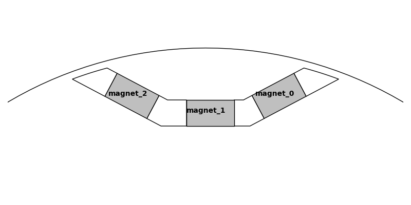
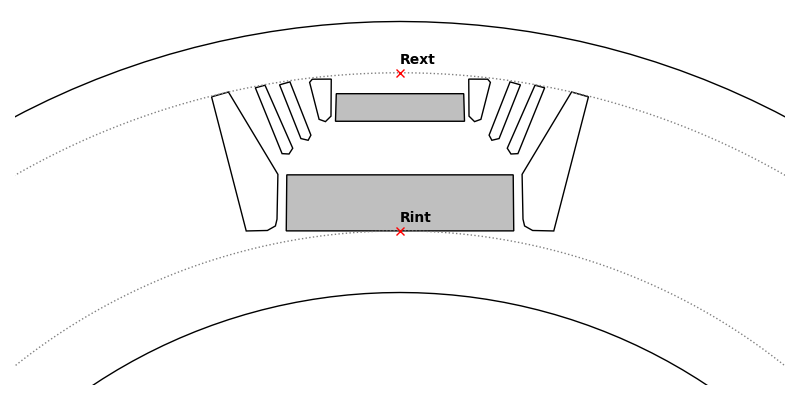

Hole Conventions
================

The magnets of each all are defined as a property like "magnet_X" with X the index of the magnet. It enables to define different material/magnetization for each magnet of the hole. The magnets index correspond to the trigonometrical order starting from 0:

For the definition of the hole geometry with build_geometry() the following conventions are used:

- build_geometry returns a list of surfaces needed to draw the hole. If possible no surface should contain another surface (typically void and magnet surfaces should exclude each other)

- each surface must have a label like "Rotor-0_HoleMag_R0-T0-S0" following these rules:

    - As for all surfaces the first part is the lamination label and the second part is the surface type (cf [labels conventions](https://pyleecan.org/label.convention.html))

    - The "Radial/R" index correspond to the index of the hole in the lamination.hole list. As a convention the holes in this list are ordered from inner to outer but this is not mandatory.

    - The "Slot/S" index correspond to the hole number starting at 0 up to Zh-1 and in trigonometrical order.

    - The "Tangential/T" index differs for void and magnet surfaces. As it is possible to remove magnets, the number of void surfaces can changed. Both magnet and void surfaces are indexed in trigonometrical order starting at 0 but for magnet the number always matches the magnet index whatever the actual number of magnets

Example:

In the example magnet_1 of the R0 hole is None, so there is no R0-T1-S0 for magnet, pyleecan skip to R0-T2-S0. Then HoleMag_R0-T2 will always correspond to lamination.hole[0].magnet_2

Hole generic methods:

- comp_radius:  returns (Rint, Rext) : the "internal" and "external" radius of the circle which correspond to the minimum and maximum radius of the point of the holes:

- comp_height: returns the difference between the external and internal radius of the hole

- get_magnet_dict: returns a dictionary with key = "magnet_X", value= the corresponding Magnet object or None

- remove_magnet: set all the magnet_X properties to None

- comp_surface: return the sum of the area of all the surfaces returned by build_geometry (a single pole)

