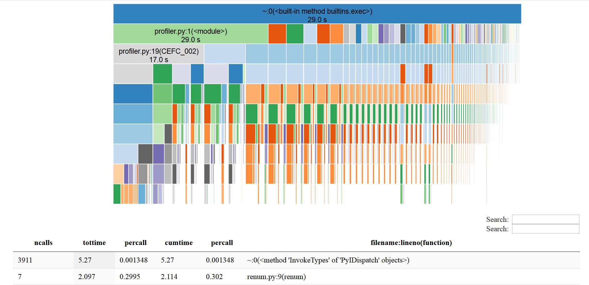
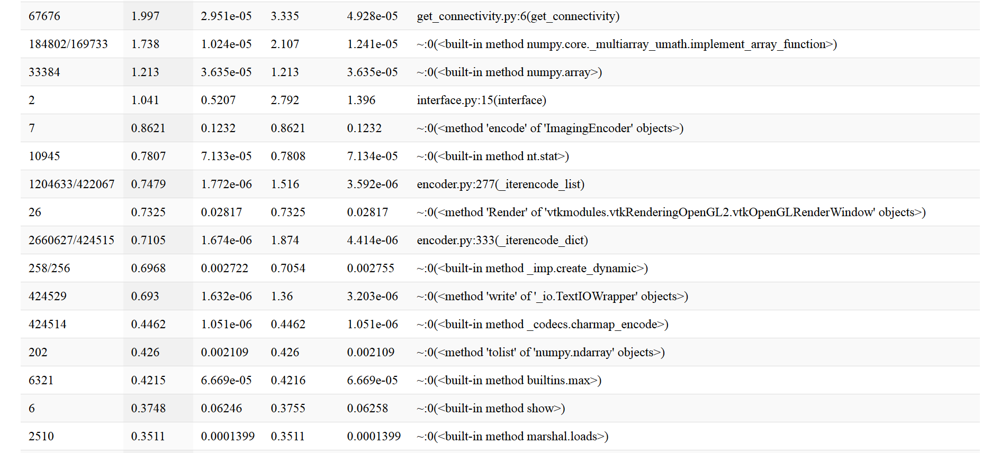

# How to use the profiler from python

Profiling a program allows to know if the code is fast and which parts of it is slowing the execution time. By having these informations, it's
easier to optimize the slow code. In python we have cProfile to profile. To profile a part of code:

```py
    import cProfile
    cProfile.run(<Function to test or code to test>)
```

CProfile is provided by python so it just need to be imported to be used. Most importantly, it is possible to profile a entire file by using this command:

```
    python -m cProfile <PathFile>\<NameFile>.py
```

Profiling the code will sometimes gives to much informations in the terminal and it will be impossible to see the complete output. There is a module
to make it more user-friendly: snakeviz. To install it:

```
    pip install snakeviz
```

Snakeviz is taking a .profile and convert it into a html file to make a GUI for the user to see the result of the profiling. To get a .profile file:

```
    python -m cProfile -o <PathFile>\<NameOfNewFile>.profile <PathFile>\<NameFile>.py
```

Then, when the .profile has been generated:

```
    python -m snakeviz <PathFile>\<NameOfNewFile>.profile
```

Doing this will open the browser and lead to a html page which will show a graphic and a array of the profiling. It's possible to sort the array.




The array can be sorted with these arguments : __ncalls  tottime  percall  cumtime  percall__. To notice : it is possible to click on a row to show its graphic
and show what is slowing this part of code.

