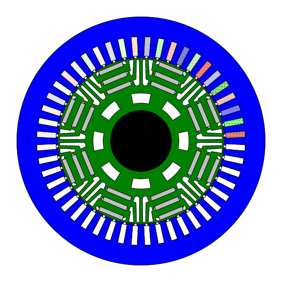
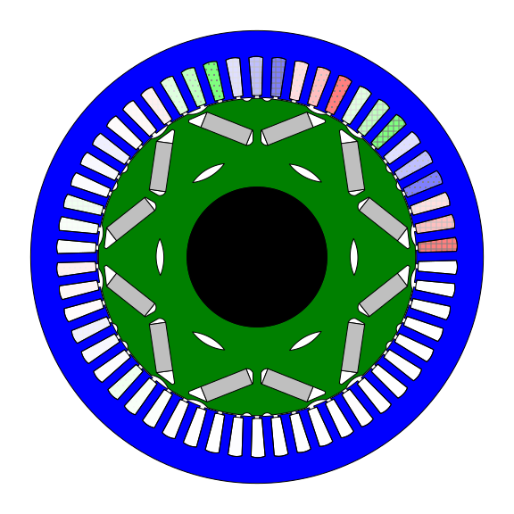

PYLEECAN
========

Presentation
------------

PYLEECAN project provides a **user-friendly, unified, flexible simulation framework for the multi-physic design and optimization of electrical machines and drives**.

The main objective of PYLEECAN is to boost **reproducible research** and **open-science** in electrical engineering. Thus, it is intended for researchers, R&D engineers and teachers in electrical engineering, both on standard and novel topologies of electrical machines. 

For example, PhD students should start with PYLEECAN:

- You can save a lot of time by using existing algorithms dedicated to electrical engineering (e.g. coupling Scilab or Matlab with Femm),
- You can benefit from the community expertise for your research.
- You can contribute to the project to make sure your code is maintained and to enable other researchers to easily reproduce your results.

To achieve all of that, Pyleecan is **open source** with a very permissive license (Apache V2 license).

Origin and Current Status of the Project
-----------------------------------------
[EOMYS ENGINEERING](https://eomys.com/?lang=en) initiated this open-source project in 2018 for the study of electric motors. The project is now backed by [Green Forge Coop](https://www.linkedin.com/company/greenforgecoop/) non profit organization, who also supports the development of [Mosqito](https://github.com/Eomys/MoSQITo) for sound quality and [SciDataTool](https://github.com/Eomys/SciDataTool) for efficient scientific data exploitation. 

**Main Models and Couplings:**

- PYLEECAN is fully coupled to [FEMM](http://www.femm.info) to carry **non-linear magnetostatic** analysis including sliding band, parallelization and symmetries. For now this coupling is available only on Windows OS (on open PR should extend FEMM to Linux soon)
- PYLEECAN includes several losses model (based on FEMM coupling output).
- PYLEECAN includes an electrical model to solve the equivalent circuit of PMSM and SCIM machines.
- PYLEECAN is coupled to [GMSH](http://gmsh.info/) **2D/3D finite element mesh generator** to run third-party multi-physic solvers. 
- PYLEECAN is coupled to two different **multi-objective optimization** libraries  (NSGA-II and Bayesian) to carry design optimization of electrical machines.
- PYLEECAN enables to define **Parameter Sweep** of variable speed simulations.

**Main Topologies Features:**

- PYLEECAN includes a **Graphical User Interface** to define main 2D radial flux topologies parametrized geometries (**SPMSM, IPMSM, SCIM, DFIM, WRSM, SRM, SynRM**) including material library and automatic single speed current driven Magnetic FEMM simulations.
- Possibility to import Slot or Hole from DXF files
- Star of Slot Winding (with [swat-em](https://swat-em.readthedocs.io/en/latest/)) and User Defined Winding
- Generic Geometry modeler to draw complex machines in the software coupled with PYLEECAN
- Notches (Yoke and Bore) / Uneven Bore or Yoke shape (compatible with slot/notches) / Machine with more than 2 laminations
Examples can be found in the [gallery](https://pyleecan.org/gallery.html).

If you are interested by a topology or a specific model, you can [open an issue](https://github.com/Eomys/pyleecan/issues) or a [discussion](https://github.com/Eomys/pyleecan/discussions) on the project Github repository to talk about it. We will gladly explain how to develop it yourself or we will add it to the development list. We are always looking for experimental data and model validation based on the last scientific research work. 
Even if you don't have time to work on pyleecan, sharing your expertise will be valued by the community. 

Getting started
---------------

- [Prerequisites](prerequisite.md)
- [Install PYLEECAN](get.pyleecan.md)
- [Project Organization](project.organization.md)
- [Tutorials](tutorials.md)
- [Developement Guidelines](development.md)
