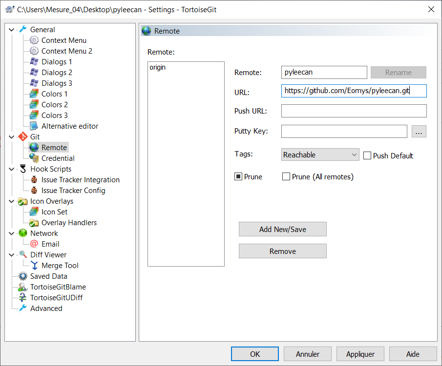

################################################
How to integrate your contribution into PYLEECAN
################################################

Once your contribution is ready, you need to share it with the community. As the code will be included in the official package, there are few steps that need to be followed for every single contribution to check its quality:

Class generator
===============
When contributing to pyleecan, the class files must always be up to date. Before sharing the modifications, the class generator must be called:
::

        python pyleecan/Generator/run_generate_classes.py

PEP8 and black
==============
The `Zen of Python <https://www.python.org/dev/peps/pep-0020/>`__ contains: "Readability counts.". Which means that any good python code should be written to be as comprehensible as possible. To achieve this goal a coding convention was set for Python to uniformize any python script in a clean way. All these conventions (maximum number of caracter per lines, indentation conventions, comments guidelines...) are gathered in the `PEP8 <https://www.python.org/dev/peps/pep-0008/>`__. So, a good Pyleecan contribution must follow the PEP8. Hopefully, there is a python package named `black <https://pypi.org/project/black/>`__ that will automatically format all your code to match the PEP8 conventions. 

The command to install black is (require Python 3.6+):
::

        pip install black

Then the command to format the pyleecan code is:
::

        python -m black /path/to/pyleecan/top/folder

Running the tests
=================
When adding the contribution to pyleecan, we need to make sure that it won't break any existing code. For that, pyleecan provides some tests that must be run before sharing any contributions. These tests will automatically call some methods or part of the code and check that no error occur and that the result is unchanged. In fact, when adding any new feature to pyleecan, the corresponding tests should be added at the same time.

The command to run all the tests is:
::

        python -m pytest ./pyleecan/Tests
More details on this command are available in the :doc:`tests contribution page </test.contribution>`.

Commit
======
The code is now clean and doesn't break any existing PYLEECAN code. The next step is to select the modifications that should be included in the contribution by right clicking on the pyleecan folder then selecting “Git commit -> "your_branch"”. In the following example, a new slot has been created in a “new_slot” branch:

.. image:: _static/tuto_slot_commit.PNG
In a contribution, several new files are generally created (csv, method files...). By default, these files are not followed by Git and have the status "Unknown". To ask Git to follow the modifications of a file, right click on the file name and "add". The new status of the file is now "Added" (green rectangle on the picture above).

Another common status is "Modified" which correspond to a file already followed by Git that was modified. By right clicking on the file name you can select "Compare with base" to know what are the differences between your local version and the one from git.

By clicking on the boxes in the blue rectangle on the image, it is possible to select which files are included in the commit. In this example we want to share all the new files, but sometimes you may have some work that you are not ready to share yet.

Finally, in the red rectangle on the image, **a meaningful message must be provided** to explain what is the purpose of the modification contained in the commit. These messages are important to understand what is going on in the project. Some commit message conventions can be found on the :doc:`coding convention page</coding.convention>`.

When the commit is ready, click on the "commit" button on the bottom left. The following window should open:

.. image:: _static/tuto_slot_push.PNG
Click on "Push" to send the modification from your computer to your forked version of pyleecan on Github.

Merge
=====
The next step is to synchronize your local repository with the official pyleecan one. Indeed, while you were working on your modification, maybe the community has introduced some new modifications. Before merging the work from the community, you need to make sure that there is no local modification not commited on your branch. Then right click on the folder "Git sync...", the following window should open:

.. image:: _static/tuto_slot_sync.PNG
The goal is to get the status of pyleecan into the "new_slot" branch. For that we first need to create a new "remote" by clicking on "Manage" (black rectangle on the image). The following window will open and should be completed as follow:

We now have a new remote that links to the official pyleecan repository on Github.
The current version of pyleecan is stored in the branch "master" on the official repository. So to get the latest modifications: 

-	"Local branch" (red rectangle on the image) is set to "new_slot
-	"Remote" (blue rectangle on the image) is set to pyleecan
-	"Remote branch" (green rectangle on the image) is set to "master".

By clicking on Pull (orange rectangle on the image), the modifications of the master branch from the official pyleecan repository will be pulled into your local "new_slot" branch. These modifications will be applied on your local code, that is why it is important that there is no modification left to commit. Once the merge is done, you may need to go again though the previous steps (class generator, black, test) to make sure that everything is still Ok and that your new modifications are included. You may also need to commit the modifications from the merge.

We recommend to also Sync the master branch with the main pyleecan master branch to be able to checkout this branch to get/use the latest version of pyleecan.

Push
====
The modifications are ready, and everything is commited. You now need to send your modification from your computer to your forked version of pyleecan on Github. For that, right click on pyleecan folder "Git Sync" and push (new_slot branch to new_slot branch of "origin": your forked version of pyleecan).

Pull Request
============
Finally, you can now propose your modification to be included in pyleecan with a Pull Request. Go into your forked repository on github and select the branch "new_slot". Github should provide a "Compare & pull request" button. 

.. image:: _static/tuto_slot_PR_1.PNG

The following page should appear:

.. image:: _static/tuto_slot_PR_2.PNG

Github provides the correct parameter for the pull request (fork pyleecan / new_slot branch => pyleecan / master) and will automatically check if the branch can be merged automatically (if not go back to "Merge" step). Please provide a meaningful title and description for your Pull Request. The easier it will be to understand the pull request, the fastest it will be accepted and shared with the community.
