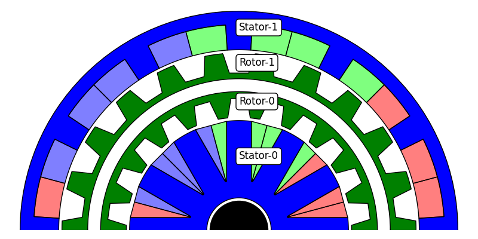

Geometry modeler and label Conventions
--------------------------------------

Pyleecan uses Object Oriented programming to provide a generic geometrical modeler. It converts any geometry pyleecan can handle into a list of generic surfaces and lines that can then be drawn more easily in a FEA software. Then when adding a new topology in pyleecan, it becomes automatically available in all the FEA software pyleecan has a coupling with (FEMM, gmsh,...). A [publication in ICEM 2020](https://pyleecan.org/icem.2020.html) further introduces this concept:

When drawing the machine in a FEA software, first the lines are drawn then the surfaces and boundary condition need to be defined. This article introduces the lamination, surfaces and lines label conventions that enable to link a generic surface/line to the property to set.

Lamination label conventions:
-----------------------------
In pyleecan not all machines have two laminations. All laminations are referred with a unique label like "Stator-<id>" or "Rotor-<id>" with <id> the number of the lamination of this kind (rotor or stator) from in to out. Example:

   
For a lamination with a rotor and a stator the corresponding labels would be "Stator-0" and "Rotor-0".

Surface label conventions:
--------------------------
Surface label must be unique within the machine to enable defining different property in any surface (for magnet demagnetization for instance). All the surface label are organized as follow: <lamination_label>_<surface_type>_<surface_index> with:
- <lamination_label> as described above ("Stator-0" for instance)
- <surface_type> one from the following list: "Winding", "Magnet", "HoleMag", "HoleVoid", "Ventilation", "Lamination" etc
- <surface_index> RX-TY-SZ with "R" for Radial, "T" for Tangential and "S" for Slot. This coordinate system is further details in the corresponding article ([winding/slot](https://pyleecan.org/winding.convention.html), [Holes](https://pyleecan.org/hole.convention.html))
For instance the label of the 1st radial layer, 2nd tangential layer of the winding in the 8th slot of the first rotor would be: "Rotor-0_Winding_R0-T1-S7"

Line property dictionary:
--------------------------
On a same line, several couplings/models may need to set different properties. Instead of a label, all the Line objects have a "prop_dict" property. As an example, all the lines where the boundary conditions needs to be defined have a key "Boundary" and a value for instance within "YokeSide", "sliding_line", etc.

How to handle labels:
---------------------
All labels definition and important functions are gathered in pyleecan/Functions/labels.py. All label definition (in build_geometry methods for instance) must use the variables defined in this file to make sure that the label are consistent and to enable renaming/extend them ("Stator" => "Stat" for instance).

    | NOT TO DO | if "Stator" in label:   |
    | ---------------------------------------- | ------------------------|
    | TO DO   | if STATOR_LAB in label: |

It also enables to find quickly where each label is used by searching for the corresponding import.

The function "decode_label" must be called when checking a surface type. It enables to check the proper part of the label easily:

    | NOT TO DO | if WIND_LAB in label:   |
    | ---------------------------------------- | ------------------------|
    | TO DO   | if WIND_LAB in decode_label(label)["surf_type"]): |