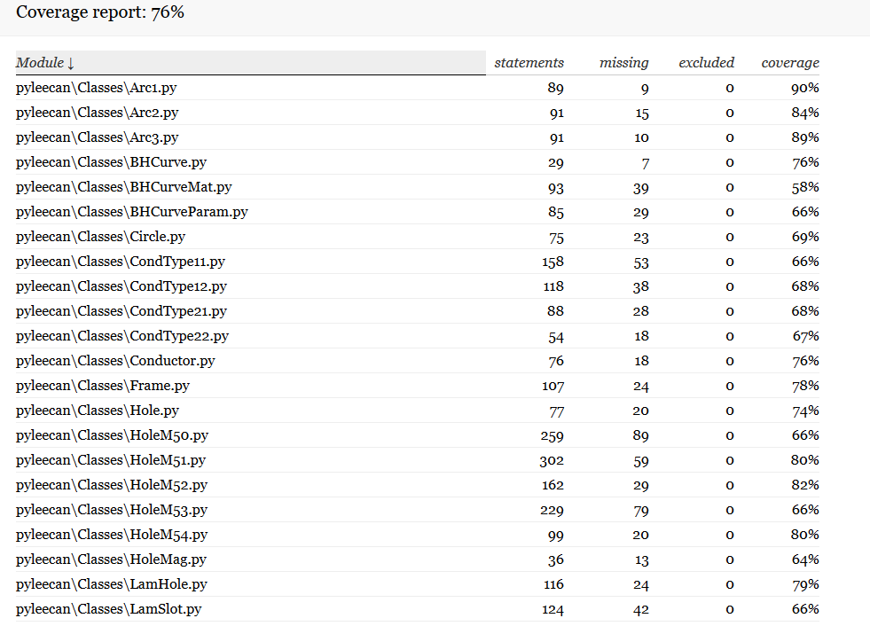
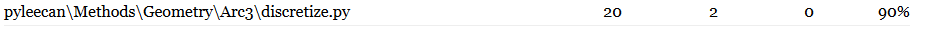
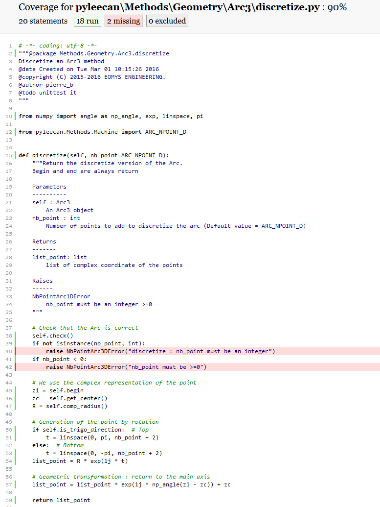

##################
Test contribution
##################

The only way to ensure that the implemented code is working and will always do, is to develop validation test. This page will
present **how to develop test for PYLEECAN**.

We invite everyone contributing to the project to systematically add tests to all their contributions if possible.

Test development guidelines
----------------------------

The python test package was initially based on `unittest <https://docs.python.org/3/library/unittest.html#module-unittest>`__,
but we decided to switch to `pytest <https://docs.pytest.org/en/latest/>`__ package. As pytest supports unittest, we still have some unittest for the moment but **every new test should use pytest**. To test a code, it is recommended to develop its specific test code for each method and each class.

Install pytest
```````````````

To install pytest, one can use the following command: 

::

            python -m pip install -U pytest


Class tests
````````````

PYLEECAN classes are generated automatically, all the classes are built in the same way. This fact enables us
to test all the classes with one test file which you can find in **Tests/Classes**. So you won't need to develop test for
the class it self but you will have to develop the tests for the methods defined in the :ref:`class.generation:Class creation`.

All the methods tests are gathered in **Tests/Methods/<subfolder>** with **Subfolder** the type of the class (*Geometry*,
*Machine*, *Slot*, etc.).


How to write a test with pytest
```````````````````````````````
With pytest, a test is a function located in file starting with “test\_” or ending with “_test”. Test function name has to begin with “test\_”.

Here is a basic example of test:

.. code-block:: python

    import pytest 

    def test_upper():
        assert 'foo'.upper() == 'FOO'

    def test_isupper():
        assert 'FOO'.isupper() 
        assert 'Foo'.isupper() == False

    def test_split(self):
        s = 'hello world'
        assert s.split() == ['hello', 'world']

        # check that s.split fails when the separator is not a string
        with pytest.raises(TypeError):
            s.split(2)

How to run the tests
````````````````````

To run the tests, you need to open a terminal, go into the folder which contains PYLEECAN and execute the command: 
::

    python -m pytest pyleecan
    
How to mark a test
``````````````````
Pytest enables to set metadata on the test functions with markers. This feature enable to exclude or include easily some tests from the test execution. This is the list of the current marker iset in PYLEECAN:

- validation : validations tests
- long : test that last more than 30 seconds
- FEMM : test using FEMM
- GMSH : test using GMSH


The following command is an example to execute only validations test that don't use FEMM: 
::

    python -m pytest pyleecan -m "validation and not FEMM"
    
To mark a test, you just need to add it a decorator: 


.. code-block:: python

    import pytest 

    @pytest.mark.validation
    def test_upper():
        assert 'foo'.upper() == 'FOO'
    
Parametrizing test
``````````````````
Pytest enables to go much further and test more cases on a single test with the *parametrize* marker : 

.. code-block:: python

    @pytest.mark.parametrize(
        ("n", "expected"),
        [
            (1, 2),
            (4, 5),
            pytest.param(1, 0, marks=pytest.mark.xfail), # <-- The test is supposed to failwith this data
        ],
    )
    def test_increment(n, expected):
        assert n + 1 == expected


Which test to develop
----------------------

An easy way to find a PYLEECAN part that need to be tested is to use `pytest-cov <https://github.com/pytest-dev/pytest-cov>`_.
This pytest extension enables to see which lines in the code are not executed by the existing tests. It can be installed with this command:

::

    python -m pip install -U pytest-cov
    
    
To run tests with coverage, use the following command:

::

        python -m pytest --cov pyleecan --cov-report=html:report_folder

The report is located in *report_folder*. Then open the index.html file:



**With the report, you will see which files and which code lines are not covered and find what to test next.**




**For example the Arc3 method discretize is not covered at 100%, there are some lines not covered as line 40 and 42
colored in pink**



In this case, there is no test to check that the discretization can handle strange arguments.
 
