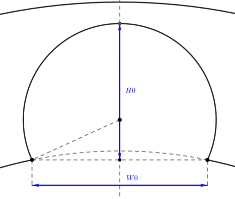
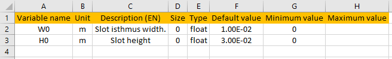
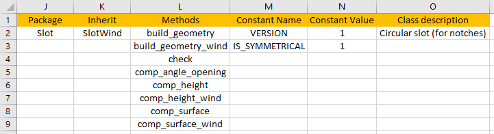
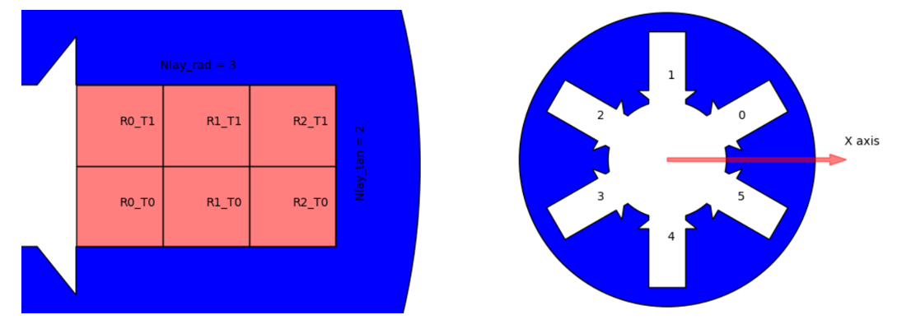
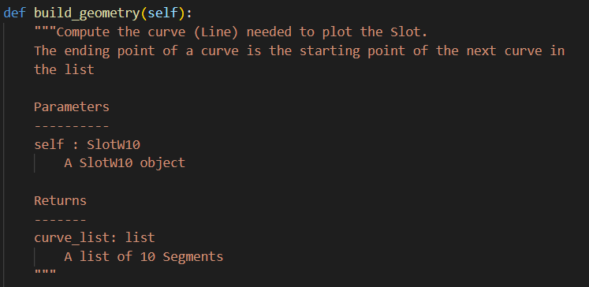
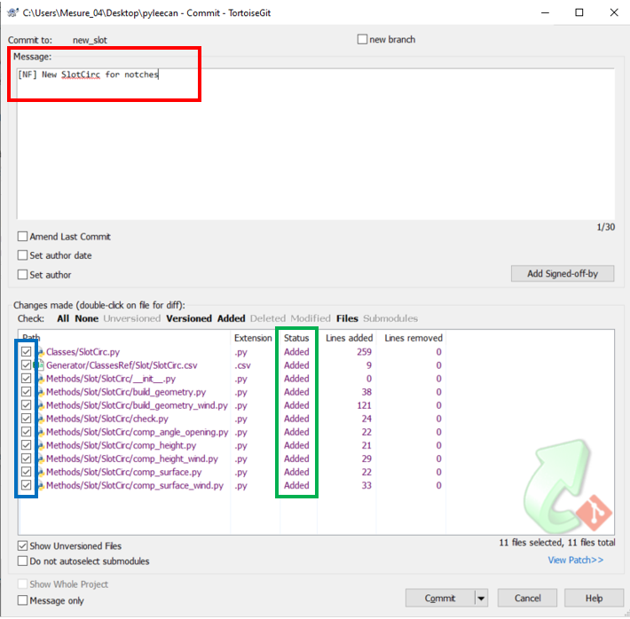
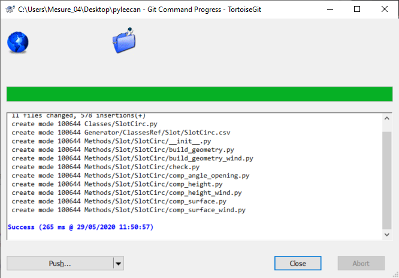
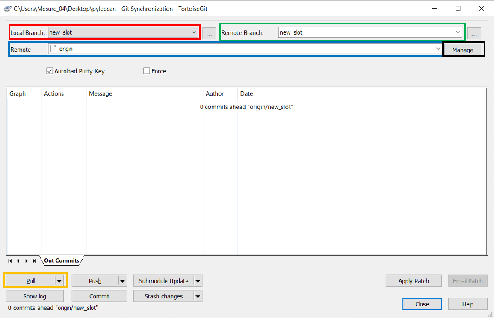
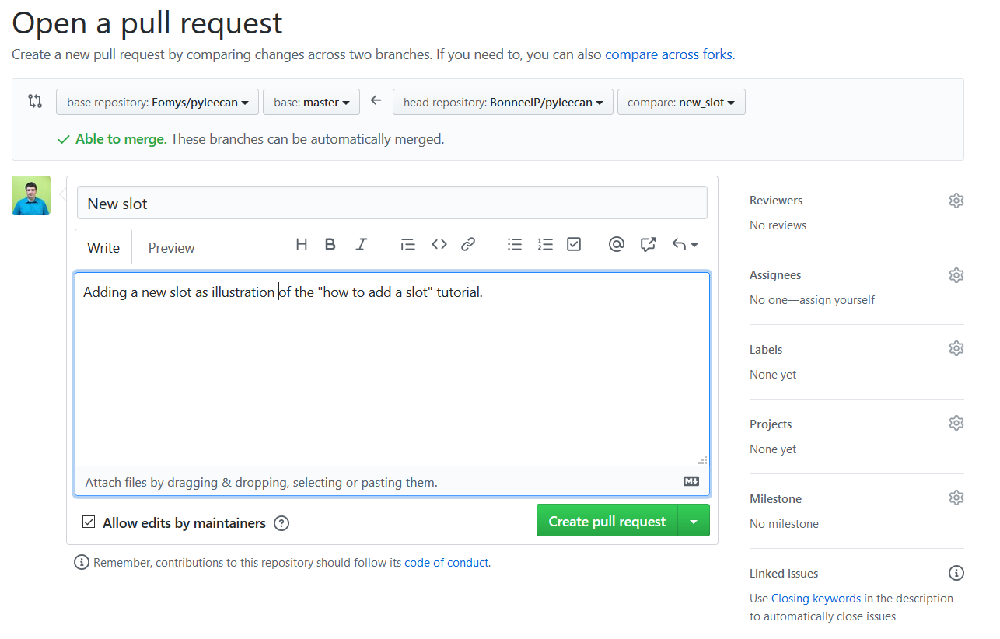

##################################
How to add a new slot in Pyleecan?
##################################
Introduction
============
Thanks to the Object-Oriented Programming architecture of Pyleecan, adding a new topology (slot, ventilation, holes…) in Pyleecan is rather simple. We will take the opportunity of this simple example to **explore in depth all the know-how and hint required to do a great contribution for the entire Pyleecan community**. We will present every single step from installing python to doing your first “pull-request” on Github. To do so, we will guide you through several other pages of this website in the correct order and with the proper introduction.

Step 1: Installing Pyleecan
===========================
To contribute to Pyleecan the first required tool is… Pyleecan. In particular, please follow :doc:`the procedure<code.contribution>` to **“fork” Pyleecan with git** (the “I want to contribute way”), it will be required for the next part of this tutorial. 

Step 2: Getting an IDE
======================
The next needed tool is an **IDE** (Integrated Development Environment). There are too many IDE to count and each developer has its own preference (and we know that the following list will never be satisfying enough for everyone). Here we will only detail few of the one that the community use (without quality ordering):  

-	`Spyder <https://docs.spyder-ide.org/index.html>`__: this one is directly included in the `Anaconda <https://www.anaconda.com/distribution/>`__ distribution which provides python with several useful scientific packages
-	`PyCharm <https://www.jetbrains.com/fr-fr/pycharm/>`__: This IDE was specially designed for python. The free version is great, but you can have a look to the commercial one if you feel that you need it.   
-	`Visual Studio Code <https://code.visualstudio.com/docs/python/python-tutorial>`__: This is Microsoft’s IDE (accessible on all platform) that provides a plugin dedicated to Python.
Last method to find an IDE: type “best IDE for python” on your favorite web browser and you will be able to find the latest debate on this topic. 

Step 3: Defining the Slot
=========================
Now that all the tools are installed, the next step is: **What are you going to contribute to?** The first place to go is the `Github issue page`_. This page gathers all the open topic from bug to correct, to new feature to add or anything to improve… Basically it is the place where the pyleecan community (users and contributors) gather to discuss about what to develop next.
For your new slot, first look at the issues to see if you can help the community by developing a slot that was requested in an issue. If you do not find any (or if you just want to do your own) you can open an issue to describe the slot you are about to add. By opening this issue, the community will be able to help you during your development and maybe tell you that the slot is already available somewhere. We can also help you to improve the slot definition so that other people will be able to use it.
For these discussions (and for your development) you will need a **schematic**: an image that shows the shape of your slot and what each parameter corresponds to. To draw your schematics, we recommend to use `Geogebra <https://www.geogebra.org/>`__ (or any equivalent tool), it will help you to be precise in the definition of each parameter which is very important for others to understand and use your slot.
In this tutorial we will define a simple circular slot (to be used for notches) named “SlotCirc” and we will use the following schematics:

.. _Github issue page: https://github.com/Eomys/pyleecan/issues

Step 4: Creating a branch with git
==================================
The first step to work on a contribution is to create a "branch on git". This tutorial will introduce some basic know-how on Git which is the tool that will enable you to share your work with the community. There are lots of tutorial and video on the web to learn about Git, the more you will learn the most efficient you will be if things get complicated. You can start with `this tutorial from Github <https://try.github.io/>`_. This tutorial focusses only on the very basis that are needed to contribute to Pyleecan "as quickly as possible". We recommend taking some time to explore some more detailed tutorials to better understand this powerful tool. In general, if you are not familiar with git, we strongly recommend using it for any valuable piece of code that you produce. It will significantly improve your work (and opening a repository on Github is free if you want to share your work).

This tutorial will use TortoiseGit on Windows which is a user-friendly way of using git:

- `Download Git <https://git-scm.com/downloads>`__
- `Download TortoiseGit <https://tortoisegit.org/download/>`__

What is Git?
------------
Git is a tool that will track every single modification of a project. It will keep in memory the full history to easily know:

- Who has done a modification, when and why?
- What is the history of a single file?

As all the project is seen as an ordered list of modifications (a file is edited, deleted, created…) Git can do the following:

- Get modifications from other users and merge it with yours
- Cancel some modifications to come back to an older version of the code.

What are branches?
------------------
To contribute to pyleecan, the first thing needed is **to create a "branch"** on your forked version of pyleecan. In the following example a branch named “new_slot” is created by right clicking on the pyleecan folder then selecting “TortoiseGit” and “Create Branch”:

.. image:: _static/tuto_slot_branch_1.PNG

A branch is a parallel version of the code that will cleanly isolate some modifications from the “official version”. It indicates from where “your version” of the code started and what was done step by step (or version by version) to get to your current state.

You then need to select your branch to start working on it. For that, right click on the pyleecan folder then “TortoiseGit” and “Switch/Checkout” and select the “new_slot” branch:

.. image:: _static/tuto_slot_branch_2.PNG

Now all further modifications will be added to the "new_slot" branch. It is possible to come back to the "original" code by “Switch/Checkout” to the branch "master".

Step 5: Creating the class
==========================
The first modification needed is to create a new Slot class. In Pyleecan all the class files are created with a tool known as the **class generator**. A dedicated documentation on this tool is available  :doc:`on the website</class.generation>`. In pyleecan/Generator/ClassesRef there is **one csv file for each class** of Pyleecan (organized by type/folder). To create a new one, copy/paste an existing csv file (for instance *SlotCirc*), rename it and edit it. The name of your file will be the name of the class and it must be unique within pyleecan. In our example we copy the csv file "pyleecan/Generator/ClassesRef/Slot/SlotW10.csv", rename it to "SlotCirc.csv" and here is the edited content:

The “left part” corresponds to the properties of the class. Two lines or two properties has been defined: one for H0 and one for W0. Both are defined to be “float” values greater than 0 and a proper documentation text has been set.

The “right part” corresponds to global information on the class. We have updated the method list (cf next chapter of this tutorial) and changed the class description.
Now that your csv file is properly edited, you need to **run the code generator** to create the corresponding python code. The corresponding command is:
::

        python pyleecan/Generator/run_generate_classes.py

The class code is now available in the pyleecan/Classes folder. You can have a look at the resulting code to see what method and feature are automatically available but this file mustn't be edited as it is erased every time the code generator is called. To change a class in pyleecan, one must change its csv file and run the code generator.

Step 6: Defining your methods
=============================
Choosing which method to implement
----------------------------------
In this part, we will finally write the first lines of code! And we have a great news: you do not have to write most of them! With Object Oriented Programming to add a new slot (with winding), the following list of method are needed:

-	build_geometry: define the edges of the slot
-	build_geometry_wind: define the surfaces for winding
-	check: Check the slot constraints
-	comp_angle_opening: Compute the opening angle of the slot
-	comp_height: Compute the height of the slot
-	comp_height_wind: Compute the height of the winding part
-	comp_surface: Compute the surface of the Slot
-	comp_surface_wind: Compute the surface of the winding part

The conventions linked to these methods are defined in the :doc:`following article<slot.convention>`.

In this list, build_geometry and build_geometry_wind are the only two mandatory methods to define. All the other can be computed numerically according to the result of these two methods. The numerical computation code is defined as methods of the *Slot* or *SlotWind* classes. The other methods (comp_surface, comp_height,...) can be defined to provide a faster analytical way of computing these values. We recommend defining all the methods, but the fastest way to add a new slot is just to define build_geometry and build_geometry_wind. Once you know which method you want to define, the “Methods” column in the csv file can be edited if needed (don't forget to run the code generator).

Creating the Method folder
--------------------------
In pyleecan, all the methods are stored in a dedicated folder that follow this generic path pyleecan/Methods/<package>/<class_name>/<method_name>.py. In our example we need to create the folder pyleecan/Methods/Slot/SlotCirc. 
You will also need to add an empty file named “__init__.py” so that the methods can be imported in other part of pyleecan. The full folder of *SlotCirc* can also copy/paste/edit as a template.
A file for each of the method listed in the csv file (build_geometry.py, comp_surface.py…) is needed. Note that if a method is present in the Methods folder but not referred in the csv file, **it will not be available in the class**. The csv file is the exhaustive description of the class.

Defining the build_geometry method
----------------------------------
For the build_geometry method, the first step is to compute the complex coordinates of each point on the edges of the slot. Note that for some slot we encapsulate the computation of the coordinates in a method named "_comp_point_coordinate". Then a list of “Line” objects is created to describe the slot edges with the following constraints:

-	The slot is centered on the 0x axis
-	The lines are ordered in trigonometrical way
-	Each Line begins with the end point of the previous one
-	Both the first and last point are on the bore radius (abs(Z)=Rbo)".

"Line" is an abstract class with the following daughter objects:

-	Segment: A straight line between two points. 
-	Arc1: An arc of circle defined by two points and a radius.
-	Arc2: An arc of circle defined by a starting point, a center and an angle.
-	Arc3: Half a circle defined by 2 points and a direction. 

The code of the other slots can be used as inspiration to define this list of Lines.

For *SlotCirc*, the build_geometry method returns a list with only one Line object. We compute the Z1 and Z2 coordinates to match W0 then we compute the radius of the circle according to H0 to define the corresponding Arc1.

Defining the build_geometry_wind method
---------------------------------------
build_geometry_wind defines the “Winding area”. It creates several *SurfLine* objects according to the number of requested surface/layers. Each surface must be labeled:
Wind_<S or R>_R<Radial id>_T<Tangential id>_S0
With <S or R> for Stator or Rotor and the radial and tangential id are defined as follow (left image):

To create a *SurfLine* object, the list of lines on the edges of this surface and a “point_ref” (a point in the surface where we can apply the property for FEA software) are needed. The code from other slots can again be used to understand how the surfaces are defined. There is also the possibility  to ask for help in the issue related to the slot. 

For *SlotCirc*, the slot is intended to be used for notches so it shouldn't contain winding. But maybe someone want to add winding in such slot, so we defined the winding related methods anyway. We define the "Winding area" to be the complete slot surface. To define the original surface, we just need to add an *Arc1* between Z2 and Z1. Then we proceed to "cut" this surface according to Nrad, Ntan.

Defining the other methods
--------------------------
All the other method should be more straight forward with the indication from the :doc:`slot conventions</slot.convention>`. Otherwise, ask for help in the issue related to the slot.

For *SlotCirc*, as the winding area matches the complete slot, comp_surface and comp_surface_wind as well as comp_height and comp_height_wind return the same values.

Docstring and documentation
---------------------------
Each method has a dedicated docstring that can be copy/paste/edit:

These docstrings are important since they are automatically scanned to generate :doc:`this website</pyleecan.Classes.SlotW10>`. So please always provide some well-defined docstring, it will help others to use the slot.

Step 7: Sending modifications to the project
================================================
Now that the contribution is ready, you need to share it with the community. As the code will be included in the official package, there are few steps that need to be done for every single contribution to check its quality:

Class generator
---------------
When contributing to pyleecan, the class files must always be up to date. Before sharing the modifications, the class generator must be called:
::

        python pyleecan/Generator/run_generate_classes.py

PEP8 and black
--------------
The `Zen of Python <https://www.python.org/dev/peps/pep-0020/>`__ contains: "Readability counts.". Which means that any good python code should be written to be as comprehensible as possible. To achieve this goal a coding convention was set for Python to uniformize any python script in a clean way. All these conventions (maximum number of caracter per lines, indentation conventions, comments guidelines...) are gathered in the `PEP8 <https://www.python.org/dev/peps/pep-0008/>`__. So, a good Pyleecan contribution must follow the PEP8. Hopefully, there is a python package named `black <https://pypi.org/project/black/>`__ that will automatically format all your code to match the PEP8 conventions. 

The command to install black is (require Python 3.6+):
::

        pip install black

Then the command to format the pyleecan code is:
::

        python -m black /path/to/pyleecan/top/folder

Running the test
----------------
When adding the contribution to pyleecan, we need to make sure that it won't break any existing code. For that, pyleecan provides some Tests that must be run before sharing any contributions. These tests will automatically call some methods or part of the code and check that no error occur and that the result is unchanged. In fact, when adding any new feature to pyleecan, the corresponding tests should be added at the same time (as explained in "Step 8: Adding some tests").

The command to run all the tests is:
::

        python -m pytest ./pyleecan/Tests
More details on this command are available in the :doc:`tests contribution page </test.contribution>`.

Commit
------
The code is now clean and doesn't break any existing pyleecan code. The next step is to select the modification that should be included in the contribution by right clicking on the pyleecan folder then selecting “Git commit -> new_slot”:

When adding a new slot, several new files are created (csv, method files...). By default, these files are not followed by Git and have the status "Unknown". To ask Git to follow the modifications of a file, right click on the file name and "add". The new status of the file is now "Added" (green rectangle on the image). 
Another common status is "Modified" which correspond to a file already followed by Git that was modified. By right clicking on the file name you can select "Compare with base" to know what are the differences between your local version and the one from git. 
By clicking on the boxes in the blue rectangle on the image, it is possible to select which files are included in the commit. In the tutorial case we want to share all the new files, but sometimes you may have some work that you are not ready yet to share.
Finally, in the red rectangle on the image, **a meaningful message must be provided** to explain what is the purpose of the modification contained in the commit. These messages are important to understand what is going on in the project. Some commit message conventions can be found on the :doc:`coding convention page</coding.convention>`.

When the commit is ready, click on the "commit" button on the bottom left. The following window should open:

Click on "Push" to send the modification from your computer to your forked version of pyleecan on Github.

Merge
-----
The next step is to synchronize your local repository with the official pyleecan one. Indeed, while you were working on your modification maybe the community has introduced some new modifications. Before merging the work from the community, you need to make sure that there is no local modification not commited on your branch. Then right click on the folder "Git sync...", the following window should open:

The goal is to get the status of pyleecan into the "new_slot" branch. For that we first need to create a new "remote" by clicking on "Manage" (black rectangle on the image). The following window will open and should be completed as follow:

.. image:: _static/tuto_slot_remote.PNG
We now have a new remote that links to the official pyleecan repository on Github.
The current version of pyleecan is stored in the branch "master" on the official repository. So to get the latest modifications: 

-	"Local branch" (red rectangle on the image) is set to "new_slot
-	"Remote" (blue rectangle on the image) is set to pyleecan
-	"Remote branch" (green rectangle on the image) is set to "master".

By clicking on Pull (orange rectangle on the image), the modifications of the master branch from the official pyleecan repository will be pulled into your local "new_slot" branch. These modifications will be applied on your local code, that is why it is important that there is no modification left to commit. Once the merge is done, you may need to go again though the previous steps (class generator, black, test) to make sure that everything is still Ok and including your new modifications. You may also need to commit the modifications from the merge.

We recommend to also Sync the master branch with the main pyleecan master branch to be able to checkout this branch to get/use the latest version of pyleecan.

Push
----
The modifications are ready, and everything is commited. You now need to send your modification from your computer to your forked version of pyleecan on Github. For that, right click on pyleecan folder "Git Sync" and push (new_slot branch to new_slot branch of "origin": your forked version of pyleecan).

Pull Request
------------
Finally, you can now propose your modification to be included in pyleecan with a Pull Request. Go into your forked repository on github and select the branch "new_slot". Github should provide a "Compare & pull request" button. 

The following page should appear:

Github provide the correct parameter for the pull request (fork pyleecan / new_slot branch => pyleecan / master) and will automatically check if the branch can be merged automatically (if not go back to "Merge" step). Please provide a meaningful title and description for your Pull Request. The easier it will be to understand the pull request, the fastest it will be accepted and shared with the community. 

Step 8: Adding some test
========================
Writing in process...

Step 9: Adding your Slot to the GUI
===================================
Writing in process...
