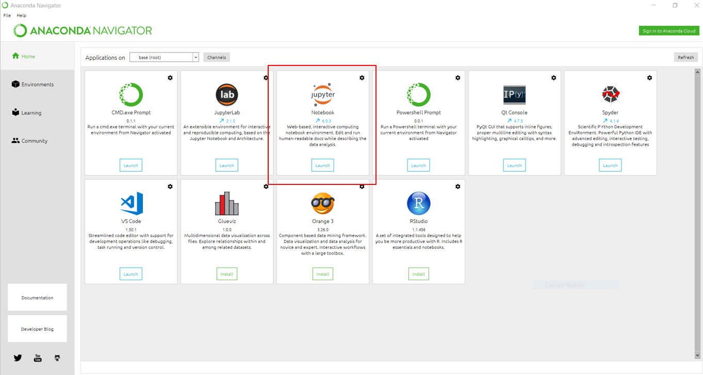
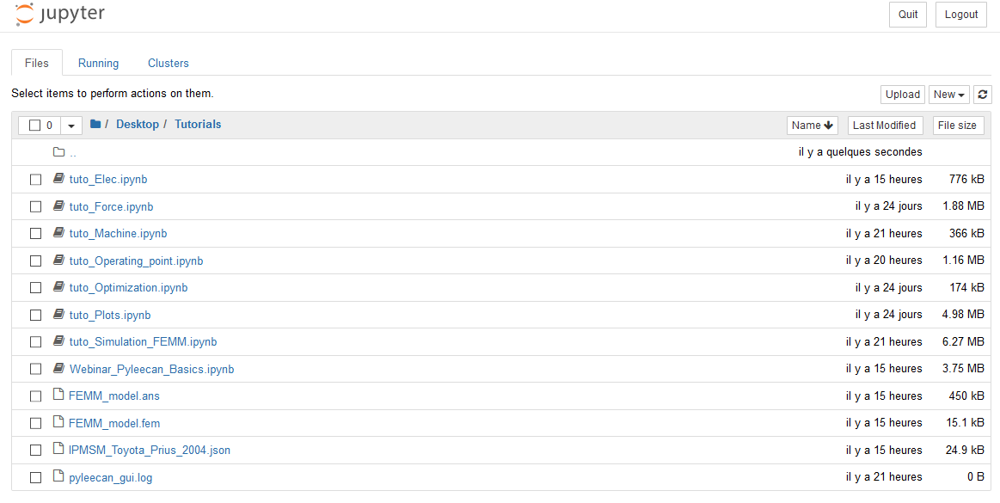

Tutorials
=========

The purpose of this section is to present some global tutorial on how to
use Pyleecan. These first tutorials are an introduction to Pyleecan that
we recommand to read in order.

* [How to define a machine](tuto_Machine.md)
* [How to define a simulation to call FEMM](tuto_Simulation_FEMM.md) 
* [How to plot results](tuto_Plots.md)
* [How to set the Operating Point](tuto_Operating_point.md)
* [How to compute currents, voltage and torque using the Electrical Module](tuto_Elec.md)
* [How to compute magnetic forces using Force Module](tuto_Force.md)
* [How to solve optimization problem in Pyleecan](tuto_Optimization.md) 
* [How to run a multi-simulation](tuto_multisimulation.md)
* [How to add a new slot in Pyleecan](tuto.add.slot.md)

How to run the tutorial
-----------------------

Each tutorial is generated from a Jupyter Notebook and can be downloaded
[on GitHub](https://github.com/Eomys/pyleecan/tree/master/Tutorials). To
run the tutorials notebook, here is the full procedure:

- Install the latest version of [Anacoda](https://www.anaconda.com/products/individual)
- Open an "Anaconda Prompt" and run the command "pip install pyleecan"
- Install the latest version of [FEMM](http://www.femm.info/wiki/Download) (Windows only)
- Download the tutorial notebooks on your computer
- Open the program "Anaconda Navigator" and launch "Jupyter Notebook"
  

- In your web browser a tab should open, move to the folder containing the notebooks
  

- Double click on the notebook to run

Anaconda include the IDE "Spyder" that enables to read notebook.

Validation simulations are also available in the Tests/Validation folder
for inspiration.

Upcoming tutorials
------------------

-   How to generate the 3D mesh of a Lamination with GMSH

If you have any question or if you want to request a new tutorial please
[contact us](contact.html).

Webinar
-------

Three public and free webinars will be organized by [Green Forge Coop](https://www.linkedin.com/company/greenforgecoop/about/) and UNICAS University:

-   [Friday 16th October 15h-17h (GMT+2): How to use pyleecan (basics)? Pyleecan basics, call of FEMM, use of the GUI](webinar_1.md)
-   [Friday 30th October 15h-17h (GMT+1): How to use pyleecan (advanced)? Optimization tools, meshing, plot commands](webinar_2.md)
-   [Friday 6th November 15h-17h (GMT+1): How to contribute to pyleecan? Github projects, Object Oriented Programming](webinar_3.md)

The webinar will be based on the tutorial, please follow "How to run 
the tutorial" instructions. [The registration form is available here](https://us02web.zoom.us/meeting/register/tZYsc-mppz8pE9UYGaTYWe6m8117qgi44EKi).

The webinars will be recorded and the video will be available on this page.
