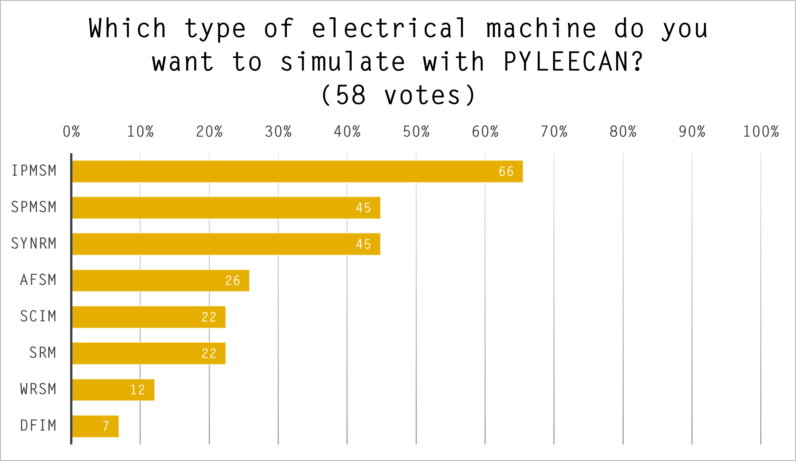
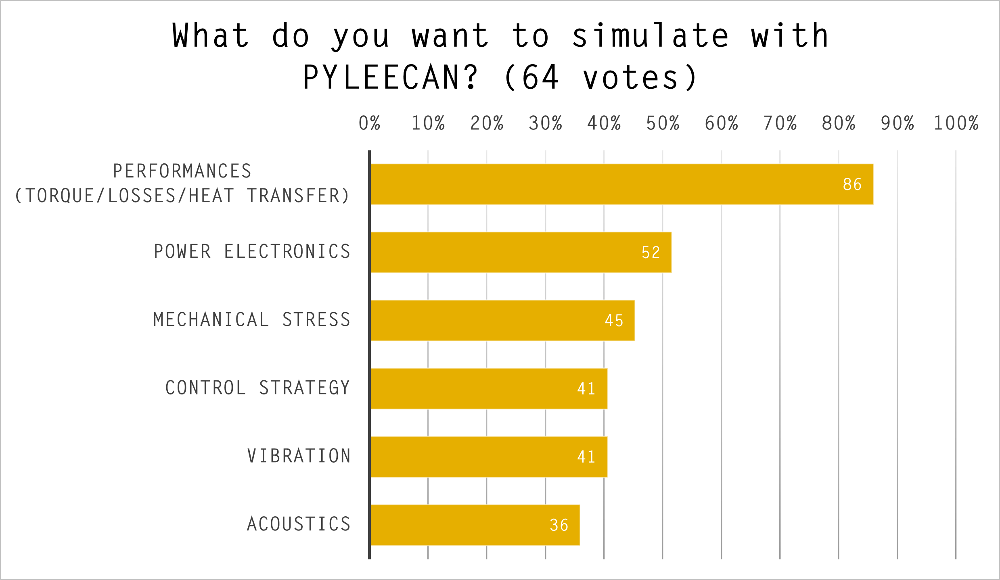
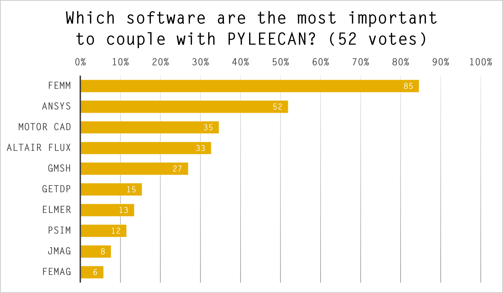

Webinar: Pyleecan Basics
========================

This page gather the resources of the first webinar that was organized by [Green Forge Coop](https://www.linkedin.com/company/greenforgecoop/about/) and UNICAS University.

- Friday 16th October 15h-17h (GMT+2): How to use pyleecan (basics)? Pyleecan basics, call of FEMM, use of the GUI

Here is the replay of the webinar:

<iframe width="560" height="315" src="https://www.youtube.com/embed/7qojT14URBQ" frameborder="0" allow="accelerometer; autoplay; clipboard-write; encrypted-media; gyroscope; picture-in-picture" allowfullscreen></iframe>

The presentation and the notebook are available [here](https://www.pyleecan.org/notebook/PYLEECAN_webinar_2020_10_16.zip). 

The notebook is also available [on Github](https://github.com/Eomys/pyleecan/tree/master/Tutorials)

To use the notebook, please follow the guide "[How to run the tutorial](tutorial.md)"

During the webinar, three surveys were organized, here are the results:

