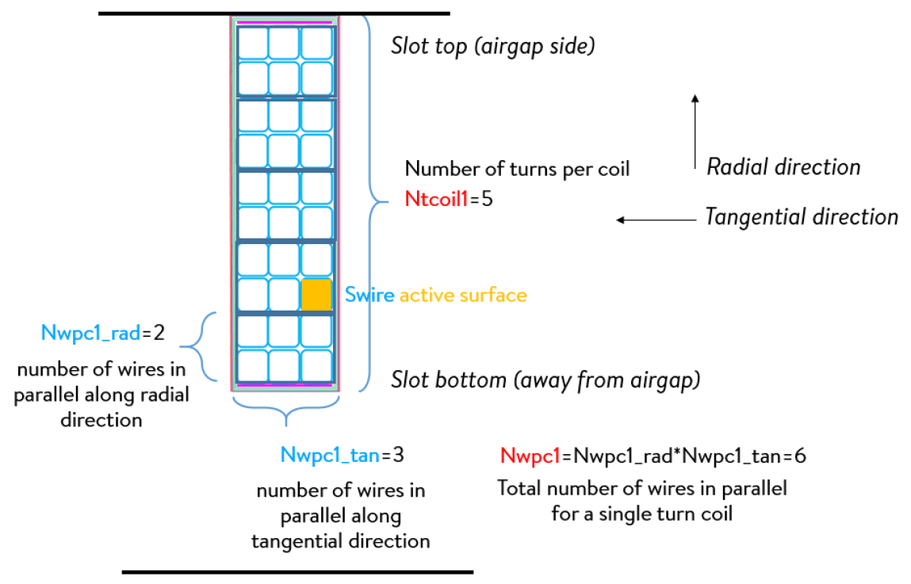
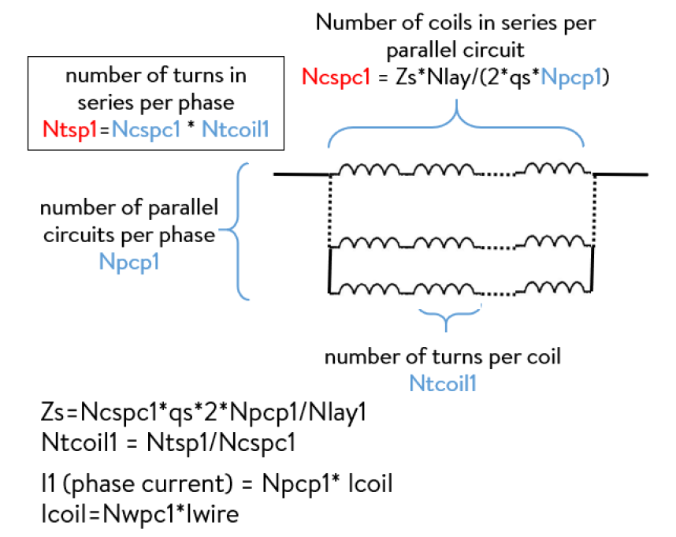

##################
Winding convension
##################

Connection matrix
-----------------
For the winding connection matrix, Pyleecan provides several automated winding algorithms that correspond to the daugthers of the "Winding class" (in particular, the "comp_connection_mat" method)
The winding connection matrix is a matrix representing the number of turns and current direction inside each Slot layer. The shape of this matrix is
(Nlay_rad, Nlay_tan, Zs, qs):

-	Nlay_rad and Nlay_tan are the number of radial and tangential layers in each slot.
-	Zs is the number of slots (see Figure below).
-	qs the number of phases. 

The winding connection matrix is a matrix of relative integer. wind_mat[a,b,c,d] is the number of coil turns Ntcoil in the layer (a,b) of the Slot n°c for the phase d. If the number of turns is positive (resp. negative), the winding is going towards the reader along Oz+ (resp Oz-). The sum of all elements of the winding connection matrix for any phase is null.

The “tangential layers” are defined in the trigonometric way, and “radial layers” from top to bottom slot (i.e. from the lamination bore to the yoke). The slots are filled in the trigonometric direction. 

.. image:: _static/winding_convention_1.PNG

Image generated with Tests/Plot/test_wind_schematics.py

Winding architecture
--------------------
In Pyleecan, the following naming convention is used:

-	A wire is the smallest active element in a winding – it can have a round or rectangular cross section.
-	A conductor is made of one or several wires in parallel, which can be vertically or horizontally stacked for rectangular wires, or randomly placed for round wires. This is an object that is physically manipulated during the winding process.
-	A coil is a set of conductors going from one slot to another with a certain number of turns in series (“number of turns per coil”).
-	A winding is the arrangement of different coils associated to different phase currents, which can be stacked in slots along different layers and connected in series or in parallel.

Example of a single layer pre-formed winding (rectangular wires):

Definition of number of coils and turns:

